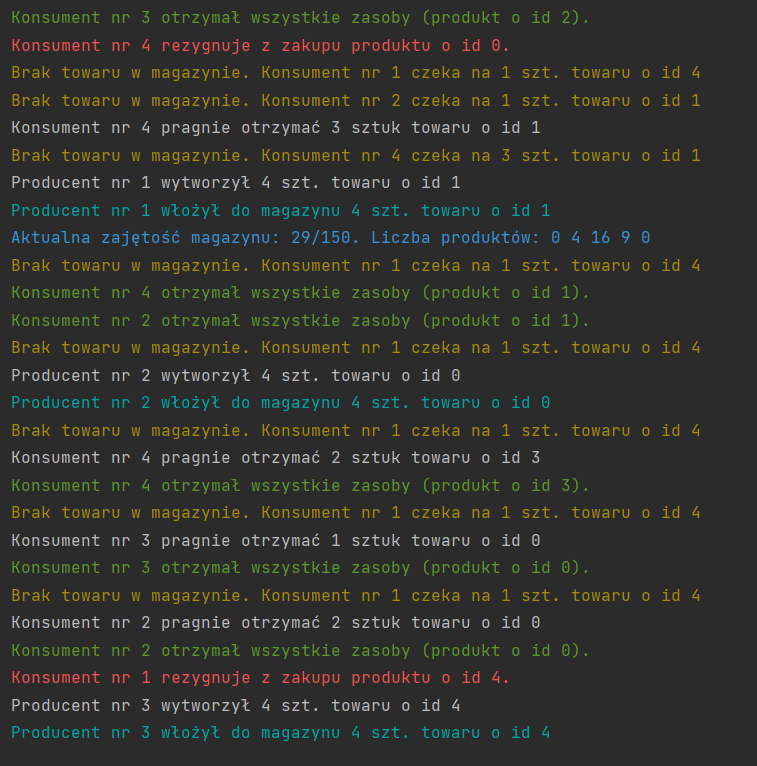

# Producer Consumer Warehouse

This project is an implementation of a producer-consumer problem using a warehouse scenario, written in Java. The program simulates a warehouse where producers create products and put them into the warehouse, and consumers take products from the warehouse.

## Architecture

The Producer Consumer Warehouse project follows a simple object-oriented architecture, consisting of four Java classes that work together to simulate the warehouse scenario.

The `Magazyn` class acts as the central data structure, representing the warehouse and keeping track of the number of products of each type that are currently in stock. The `Producent` and `Konsument` classes represent the producers and consumers, respectively, and perform operations that modify the state of the `Magazyn` object. Finally, the `Main` class acts as the entry point for the program, initializing the `Magazyn` object and starting the `Producent` and `Konsument` threads.

To synchronize access to the `Magazyn` object, the project uses the `wait()` and `notifyAll()` methods to implement the producer-consumer problem synchronization mechanisms. In the `Magazyn` class, the `konsumuj()` and `produkuj()` methods are synchronized and use the `wait()` and `notifyAll()` methods to synchronize access to the `zasoby` array. When a consumer thread calls the `konsumuj()` method, it first checks if there are enough products of the requested type in the warehouse. If there are not enough products, the consumer thread waits by calling the `wait()` method, which releases the lock on the `Magazyn` object and waits for a notification that more products have been produced. When a producer thread calls the `produkuj()` method, it first checks if there is enough space in the warehouse to store the requested number of products. If there is not enough space, the producer thread waits by calling the `wait()` method, which releases the lock on the `Magazyn` object and waits for a notification that some products have been consumed. When a producer thread successfully produces a batch of products or a consumer thread successfully consumes a batch of products, it calls the `notifyAll()` method to wake up any waiting threads and allow them to check if their requested products are now available. These synchronization mechanisms ensure that producers and consumers access the warehouse data structure in a thread-safe manner, without conflicting with each other or violating the constraints of the warehouse capacity and product availability.

## Technologies

The Producer Consumer Warehouse project is written in Java and requires a Java Development Kit (JDK) to compile and run. The project uses Maven as a build automation tool and dependency management system.

The `pom.xml` file in the project root directory is a configuration file for Maven. It specifies the project metadata, dependencies, and build settings.

## Screenshots



## Getting Started

To compile and run the Producer Consumer Warehouse project, you will need to have the following software installed on your system:

- JDK 15 or later
- Maven 3.6.0 or later

Once you have installed these dependencies, you can run the program by executing the following commands from the project root directory:

```
mvn clean package
java -cp target/classes Main
```

This will build the project using Maven and create a `jar` file in the `target` directory. You can then run the program by executing the `Main` class using the `java` command.